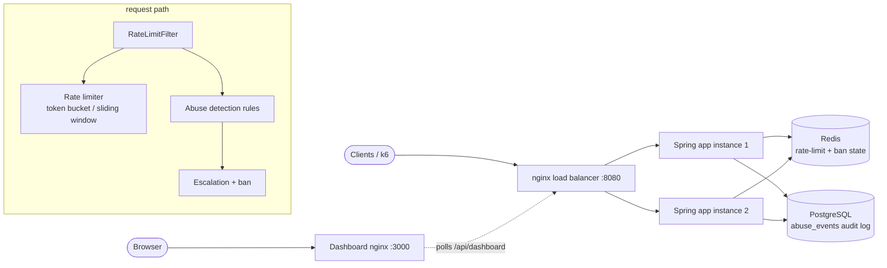
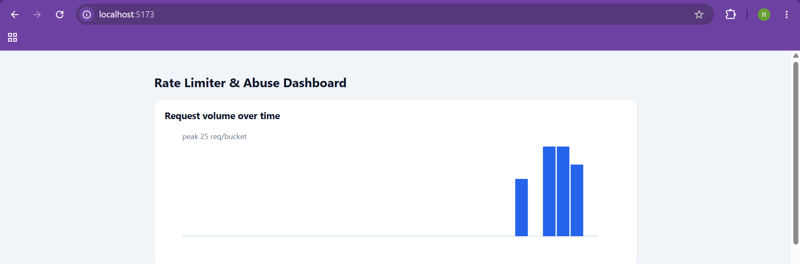
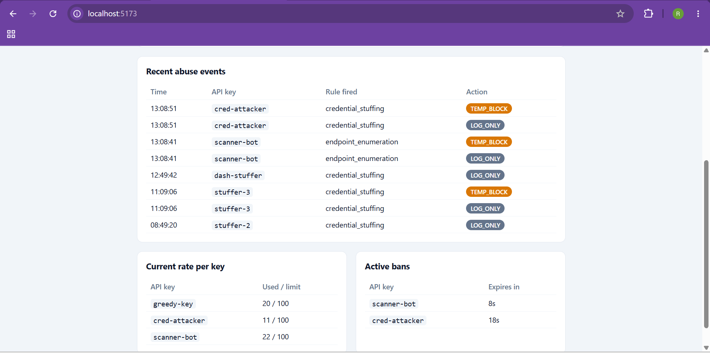

# Secure API Abuse Detection & Rate-Limiting Platform

A Spring Boot gateway that rate-limits requests per API key and detects abusive
traffic patterns, built as a portfolio project focused on **provable correctness**
rather than feature count. Every non-trivial decision is explained in the
per-phase notes (`PHASE1_NOTES.md` … `PHASE5_NOTES.md`).

## What it does

- **Per-API-key rate limiting** — hand-rolled token-bucket and sliding-window
  limiters, correct under concurrency on a single node and **globally correct**
  across multiple instances via an atomic Redis Lua script.
- **Rule-based abuse detection** — velocity anomaly, endpoint enumeration, and
  credential stuffing, each an independent rule, with escalating responses
  (log → temporary block → longer ban) and a PostgreSQL audit trail.
- **Cost-weighted limiting** — expensive endpoints consume more of the budget.
- **Live dashboard** — request volume, recent abuse events, current rates, and
  active bans.
- **Load-tested** — a k6 script drives baseline traffic plus three attacker
  profiles against the full multi-instance stack.

## Architecture



Each request flows through `RateLimitFilter`: it checks for an active ban, applies
the cost-weighted rate limit (atomic in Redis), runs the pre-request detection
rules, forwards to the endpoint, then runs the post-response rule (credential
stuffing needs the status code). Triggered rules write to Postgres and escalate
via shared Redis state.

## Tech stack

Java 21 · Spring Boot 4 · Redis (Lettuce) · PostgreSQL (Flyway) · plain React
(Vite) · k6 · Docker Compose.

## Run the whole stack (one command)

Requires Docker Desktop.

```
docker compose up --build -d
```

This starts six containers: two app instances, an nginx load balancer, Redis,
PostgreSQL, and the dashboard.

- API (through the load balancer): http://localhost:8080
- Dashboard: http://localhost:3000

Try it:
```
# allowed
curl -H "X-API-Key: demo" http://localhost:8080/api/products
# exceed the limit (default 10/key/window) -> 429 with Retry-After
for i in $(seq 1 15); do curl -s -o /dev/null -w "%{http_code}\n" -H "X-API-Key: demo" http://localhost:8080/api/products; done
```

Stop everything:
```
docker compose down          # add -v to also wipe Redis/Postgres data
```

## Run the load test

Install [k6](https://k6.io/docs/get-started/installation/). Temporarily set
`ratelimiter.capacity=100` in `src/main/resources/application.properties` and
rebuild, so the abuse rules (not the rate limiter) are the binding constraint,
then:

```
k6 run -e CAPACITY=100 load-test/loadtest.js
```

Results are written to `load-test/summary.txt`. See `PHASE5_NOTES.md` for the full
methodology, including how rate-limit correctness is proven separately from the
concurrent load run.

## Load test results

Measured on a local machine (two dockerized app instances), so figures reflect
this setup, not production hardware:

- **Throughput:** ~634 req/s sustained across baseline + three attacker scenarios.
- **Latency added by the rate-limit + detection path:**
  p50 ≈ 1.7 ms, p95 ≈ 3.6 ms, p99 ≈ 7.5 ms
  (vs a filter-bypassing control at p50 ≈ 1.4 ms, p95 ≈ 2.4 ms, p99 ≈ 4.0 ms) —
  roughly 1–3.5 ms of overhead.
- **Zero requests exceeded the limit:** an isolated single-key burst of 400
  requests at a limit of 100 allowed exactly 100 and threw 429 for the other 300,
  with the Redis counter reading exactly 100.
- **All three attacker profiles flagged** and escalated (log → temporary block)
  in the `abuse_events` audit table: credential stuffing (49 log, 48 temp-block)
  and endpoint enumeration (28 log, 27 temp-block); the hammer key is caught by
  rate limiting.




## Design decisions: naive → thread-safe → distributed-safe

The core of this project is getting the rate limiter *provably* correct, in three
deliberate steps.

**1. Naive (single node, broken).** The first token-bucket implementation read the
counter, checked it against the limit, and wrote the decrement back — three
separate steps on a plain `HashMap`. Under concurrent requests these steps
interleave: two threads both read the same count, both pass the check, and both
write, so more requests are allowed than the limit. A 50-thread test proved this,
letting 11+ through a limit of 10.

**2. Thread-safe (single node, correct).** Replacing the map value with an
`AtomicInteger` and the read-check-write with a compare-and-swap retry loop makes
the operation atomic *within one JVM*. Only one thread can win a given
`compareAndSet`; the loser retries against the current value, so no decrement is
lost. The same test now holds at exactly 10.

**3. Distributed-safe (many nodes, correct).** With two app instances sharing one
Redis, the single-JVM guarantee isn't enough: a naive "GET then INCR" across two
round trips lets both instances read the same stale count and over-admit — and the
network gap makes the race far wider (a multi-instance test let 60 through a limit
of 10). The fix moves the check-and-increment into a single Redis **Lua script**
run with one `EVAL`. Redis executes a script atomically to completion, so no
command from any instance can interleave — the limit holds globally.

The sliding-window limiter (a Redis sorted set) exists because the fixed-window
token bucket permits up to 2× the limit across a window boundary; the rolling
window has no boundary to burst across.

Detection state is kept per-instance (heuristic, advisory) while bans are shared
in Redis (enforcement must be global) — a deliberate split explained in
`PHASE3_NOTES.md`.

## Project layout

```
src/main/java/.../ratelimit   rate limiter interface + 4 implementations
src/main/java/.../abuse       AbuseRule interface, 3 rules, escalation, audit
src/main/java/.../dashboard   read-only dashboard API
src/main/resources/scripts    Redis Lua scripts (atomic limiter logic)
src/main/resources/db         Flyway migration for abuse_events
dashboard/                    React (Vite) dashboard
load-test/                    k6 load test + results
PHASE*_NOTES.md               per-phase design notes and evidence
```